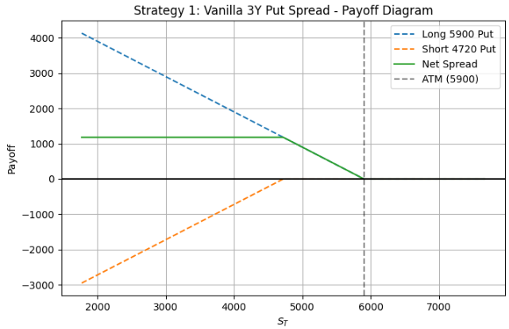
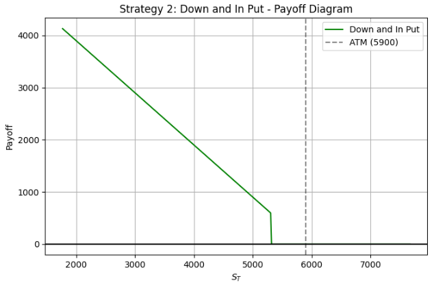
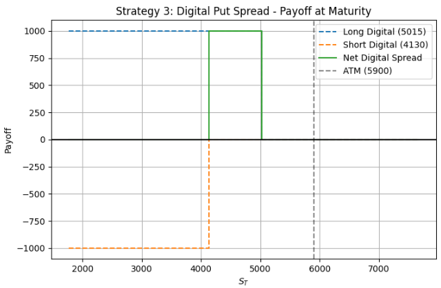
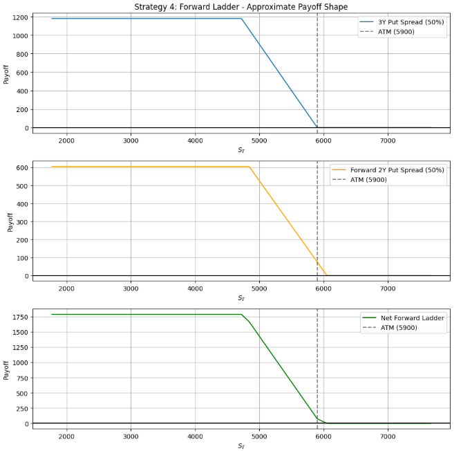
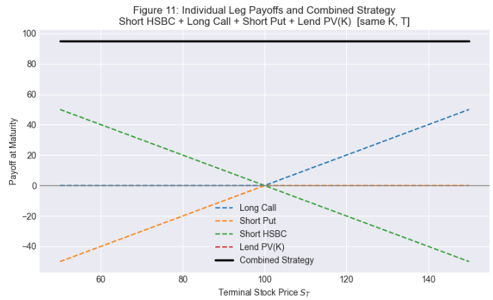
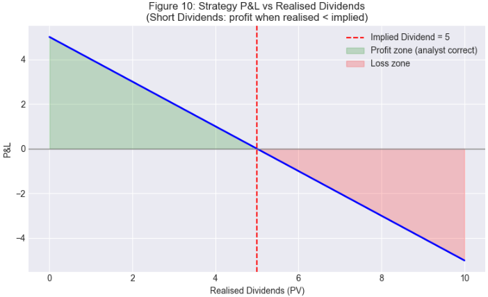

# Derivative Strategies – Structured Protection & Dividend Arbitrage

A Python-based derivatives pricing and strategy analysis project covering four bespoke downside protection structures for an institutional client, and a pure dividend arbitrage trade on HSBC using put-call parity. All vanilla and exotic option prices are computed via Monte Carlo simulation under the risk-neutral measure.

---

## Objective

This project addresses two related practical problems in derivatives:

1. **Structured Protection (Question 1):** Design and price four alternative downside hedging strategies for a client with a moderate bearish view on an equity index (S&P 500, spot = 5900), each offering a different cost-protection trade-off relative to a vanilla ATM put baseline
2. **Dividend Arbitrage (Question 2):** Construct a delta-neutral, vega-neutral trade on HSBC that isolates and profits from the gap between the market's implied dividend expectation and the analyst's lower realised dividend forecast

---

## Repository Structure

```
derivative-strategies/
├── README.md
├── Results.md
├── Actual_derivative_strategies.ipynb    # Question 1: Structured protection strategies
├── dividend_bet_fixed.ipynb              # Question 2: HSBC dividend arbitrage
└── images/
    ├── dividend_pnl.png
    ├── dividend_payoff_diagram.png
    ├── risk_return_matrix.png
    ├── strategy1_put_spread_payoff.png
    ├── strategy1_scenario_analysis.png
    ├── strategy2_down_and_in_payoff.png
    ├── strategy2_scenario_analysis.png
    ├── strategy3_digital_spread_payoff.png
    ├── strategy3_scenario_analysis.png
    ├── strategy4_forward_ladder_payoff.png
    └── strategy4_scenario_analysis.png

```

---

## Market Parameters (Question 1)

| Parameter | Value |
|---|---|
| Spot Price (S₀) | 5,900 |
| Risk-Free Rate (r) | 4% |
| Dividend Yield (q) | 1.5% |
| Implied Volatility (σ) | 18% |
| Time to Maturity | 3 years |
| Simulation Paths | 50,000 |
| Time Steps | 756 (daily) |
| Vanilla ATM Put Baseline | $484.01 |

---

## Methodology

All four strategies in Question 1 are priced using **Monte Carlo simulation** under the risk-neutral measure with 50,000 paths and daily time steps (Δt = 1/252). This approach is chosen over closed-form Black-Scholes approximations because it naturally handles path-dependent features (barrier breach, forward start timing), American optionality via backward induction, and provides Monte Carlo standard errors for validation. Each strategy's price and scenario distribution is compared against the vanilla ATM put baseline.

---

## Question 1 — Structured Protection Strategies

### Strategy 1: Vanilla Put Spread (3-Year)

A long ATM put at 5900 combined with a short put at 4720 (80% of spot). The client receives full downside protection until −20%, where the payoff caps. The short lower-strike leg offsets the premium of the long put, reducing cost by **27.9%** relative to the vanilla baseline.



---

### Strategy 2: Down-and-In Put (3-Year)

A barrier option that becomes a vanilla ATM put (5900 strike) only if the index touches the barrier of 5310 (−10% of spot) at any point during the 3-year life. Before barrier breach, the option is inactive and the client is unhedged.



---

### Strategy 3: Digital Put Spread (3-Year)

A long digital put at 5015 (−15% of spot) combined with a short digital put at 4130 (−30% of spot). The strategy pays a fixed $1,000 if the index ends in the −15% to −30% band at maturity, and zero otherwise.



---

### Strategy 4: Forward Put Spread Ladder (3-Year)

A combination of two equally-weighted (50% each) put spread legs: a standard 3-year vanilla put spread and a 1-year forward-starting put spread with a 2-year maturity. The forward leg defines its strikes as 100% and 80% of the spot level at the forward start date (t = 1 year), rather than using fixed strikes set today.



---

### Strategy Comparison

| Strategy | Price | Cost Saving | Protection Quality | Key Risk |
|---|---|---|---|---|
| Vanilla ATM Put | $484.01 | 0% | Full, unlimited | Premium cost |
| Put Spread | $348.96 | 27.9% | Full to −20%, capped below | Tail exposure beyond −20% |
| Down-and-In Put | $480.71 | 0.7% | Full once activated | Activation uncertainty |
| Digital Put Spread | $141.29 | 70.8% | Binary: pays only in −15% to −30% band | Extreme gamma, no tail coverage |
| Forward Ladder | $343.60 | 29.0% | Continuous, 3-year | Term structure risk |

---

## Question 2 — HSBC Dividend Arbitrage

### Setup

An analyst believes the market is overestimating HSBC's 2026 dividend, and that this mispricing is not yet reflected in stock or options prices. The objective is to construct a position that is neutral to delta, gamma, and vega — isolating pure dividend risk.

### Theoretical Foundation

The strategy is grounded in **put-call parity**, which embeds dividends in the no-arbitrage relationship between calls, puts, and the underlying:

$$C - P = S_0 - PV(K) - PV(D)$$

Because the market is overestimating dividends, implied PV(D) is too high. When actual dividends are realised lower than implied, PV(D) falls and option prices adjust. To profit from this, the position takes a short stance on implied dividends by rearranging the equation:

$$-PV(D) = -S_0 - P + C + PV(K)$$

### Trade Construction

| Position | Direction | Rationale |
|---|---|---|
| HSBC Stock | Short | Locks in the market's overpriced implied dividend; receives more than expected value |
| Call Option (same K, T) | Long | Offsets delta exposure from short stock |
| Put Option (same K, T) | Short | Offsets delta exposure from short stock |

The three legs together (long call, short put, short stock) eliminate delta, vega, and interest rate sensitivity. PV(K) is a present-value accounting adjustment embedded in the cash flows, not a separately traded leg. The portfolio is left exposed solely to the spread between implied and realised dividends.



### Payoff at Maturity

In both terminal scenarios (Sᵀ > K and Sᵀ < K), the stock and option legs cancel exactly to −K, which is offset by the PV(K) cash inflow at initiation growing to K at the risk-free rate. The net payoff in all cases is:

$$\text{PnL} = \text{Implied Dividends} - \text{Realised Dividends}$$

The strategy profits when realised dividends come in below the market's implied expectation, which is the analyst's core thesis.



---

## How to Run

**Requirements:** Python 3.8+

Install dependencies:
```bash
pip install numpy pandas matplotlib scipy
```

Run the notebooks in order:

1. **`Actual_derivative_strategies.ipynb`** — Prices all four structured protection strategies via Monte Carlo simulation. Produces payoff diagrams, scenario analysis bar charts, and a risk-return matrix comparing all strategies against the vanilla baseline.

2. **`dividend_bet_fixed.ipynb`** — Constructs the HSBC dividend arbitrage trade. Produces the P&L vs realised dividends chart and the individual leg payoff diagram showing how the three positions combine to a flat payoff regardless of terminal stock price.

Both notebooks are self-contained with inline commentary.

---

## Skills & Tools

`Python` `NumPy` `Matplotlib` `Monte Carlo Simulation` `Risk-Neutral Pricing`  
`Vanilla Options` `Exotic Options` `Barrier Options` `Digital Options` `Forward-Starting Options`  
`Put Spread` `Put-Call Parity` `Dividend Arbitrage` `Greeks Analysis` `Scenario Analysis`  
`Structured Products` `Derivatives Pricing` `Black-Scholes` `Quantitative Finance`

---

## Potential Extensions

- **Stochastic volatility (Heston model)** to relax the flat implied vol assumption and better price path-dependent exotics whose value is sensitive to the volatility surface
- **Local volatility model** calibrated to a full implied vol surface for more accurate barrier and digital pricing
- **Greeks time series** — computing and plotting delta, gamma, vega, and theta over the option life to better illustrate risk management dynamics
- **Sensitivity analysis** on key inputs (spot, vol, rates, dividend yield) to stress-test strategy prices and payoffs
- **Variance reduction techniques** (antithetic variates, control variates) to improve Monte Carlo convergence at lower path counts
- **Dividend futures or total return swap** as alternative instruments for the dividend trade, allowing comparison of execution efficiency

---

## Author

**Kobby Akuoko**  
