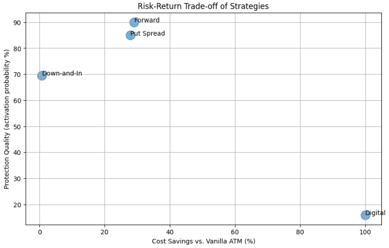

## Question 1 — Structured Protection Strategies

### Strategy 1: Vanilla Put Spread (3-Year)

| Strategy | Price | Cost Saving |
|---|---|---|
| Vanilla ATM Put (Baseline) | $484.01 | 0% |
| Vanilla Put Spread (L 5900 / S 4720) | $348.96 | 27.9% |

The vanilla put spread offers a more efficient alternative to a standalone ATM put while 
maintaining significant downside protection. It provides full coverage from the current level 
down to approximately −20%, aligning well with the client’s moderate bearish view, but 
protection is capped beyond this level. While this means potential gains are not fully 
realized in extreme scenarios, the structure matches the client’s downside conviction and 
avoids paying for unlikely outcomes. Importantly, the put spread retains full upside 
participation, as no call is sold. From a risk perspective, it is more efficient than a vanilla 
put, with lower gamma and vega exposure due to the short lower strike leg, as well as 
positive theta that reduces time decay. Liquidity risk is not an issue, as both legs are 
standard instruments. Overall, the put spread delivers lower total risk and improved cost 
efficiency, with tail risk appropriately constrained to the client’s expectations. 

### Strategy 2: Down-and-In Put (3-Year)

| Strategy | Price | Cost Saving |
|---|---|---|
| Vanilla ATM Put (Baseline) | $484.01 | 0% |
| Down-and-In Put (Barrier 5310) | $480.71 | 0.7% |

The digital put spread offers a significantly cheaper alternative to a vanilla ATM put, 
reducing upfront cost by around 70% and lowering exposure to vega. However, this 
efficiency comes at the expense of a much narrower and more conditional protection 
profile. Unlike a vanilla put, which provides continuous downside coverage, the digital 
spread only pays within a defined range (−15% to −30%), leaving the client empty handed 
outside this zone. This creates a gamble for the client, as they will not benefit at all if the 
index only decreases slightly. Additionally, the strategy introduces concentrated Greeks 
risk, with extreme gamma at the strike boundaries, leading to sharp and potentially 
unstable P&L movements if the market fluctuates around these levels. Liquidity is also 
weaker, with wider spreads and a more complex valuation for the exotic option. Despite its 
lower cost, the digital spread does represent higher risk in most scenarios. 

### Strategy 3: Digital Put Spread (3-Year)

| Strategy | Price | Cost Saving |
|---|---|---|
| Vanilla ATM Put (Baseline) | $484.01 | 0% |
| Digital Put Spread (L −15% / S −30%) | $141.29 | 70.8% |

The down and in put provides a more conditional form of downside protection compared to 
a vanilla ATM put. Unlike the vanilla structure, which offers immediate and continuous 
protection, the down and in put only becomes active once a predefined barrier (−10% of 
spot) is breached, creating initial activation risk. This means the client remains unhedged 
in moderate drawdowns and could receive nothing if the barrier is never triggered. 
However, given a strong conviction that markets will eventually decline beyond the barrier, 
this risk becomes less significant. Once activated, the strategy offers equivalent unlimited 
downside protection to a vanilla put. It also improves risk efficiency through a reduced 
Greeks exposure, including lower vega and positive theta while the option is inactive. The 
main trade-offs are activation uncertainty and slightly lower liquidity, but overall the 
structure offers conditionally lower risk, especially considering the client’s market view. 

### Strategy 4: Forward Put Spread Ladder (3-Year)

| Strategy | Price | Cost Saving |
|---|---|---|
| Vanilla ATM Put (Baseline) | $484.01 | 0% |
| Forward Put Spread Ladder | $343.60 | 29.0% |

The forward ladder provides a cost efficient alternative to a vanilla ATM put while 
maintaining similar downside protection over the full three-year horizon. By combining 
present and forward starting put spreads, it ensures continuous coverage with no gaps, 
and can even be considered lower risk structurally, as future protection levels are locked in 
today. Using forward based strikes also reduces the premium relative to a fixed strike 
forward spread, because the forward leg has a shorter effective maturity and typically 
higher strikes, resulting in lower time value and cost. The strategy also exhibits lower 
Greeks risk, particularly with less vega and smoother theta decay that aligns better with 
the 3 year time period. However, it introduces some term structure risk, as forward rates 
are fixed in advance and may become less attractive if market conditions shift. There is 
also slightly higher liquidity risk due to wider bid-ask spreads and greater structural 
complexity. Overall, the forward ladder offers lower or equal risk with strong cost and 
efficiency advantages. 

### Risk Matrix Comparing Each Strategy

